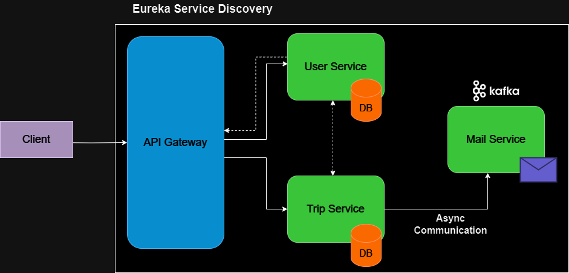

# Trip Planner Microservices

Trip Planner Microservices é um planejador de viagens construído na arquitetura de microsserviços, desenvolvido com 
o **Java Spring Framework**. O objetivo é gerenciar uma viagem, onde os usuários podem criar uma viagem, convidar 
outros usuários para participarem, adicionar atividades para serem seguidas durante a viagem, e links que sejam 
pertinentes. <br />
O Trip Planner é constituído por 5 aplicações independentes que comunicam entre si, sendo uma aplicação responsável 
por gerenciar todas as operações relacionadas ao usuário, uma para as viagens, uma para o envio de e-mail com o 
convite de participação da viagem, um gateway para receber todas as requisições, e um server de **Service 
Discovery** para orquestrar todos os serviços.

<br />



<br /><br />

<p align="center">
    <a href="#tech">Tecnologias utilizadas</a> •
    <a href="#resources">Funções/Recursos</a> •
    <a href="#endpoints">Rotas da API</a> •
    <a href="#run">Como rodar a aplicação</a> •
    <a href="#license">Licença</a> •
    <a href="#author">Autor</a>
</p>

<hr />

<h2 id="tech">💻 Tecnologias utilizadas</h2>

As ferramentas que foram utilizadas na construção do projeto:
- [Java 17](https://docs.oracle.com/en/java/javase/17/)
- [Spring Boot 3 (Spring 6)](https://spring.io/projects/spring-boot#overview)
- [Spring Security 6](https://docs.spring.io/spring-security/reference/index.html)
- [Spring Cloud Gateway](https://docs.spring.io/spring-cloud-gateway/docs/current/reference/html/)
- [Spring Cloud Netflix Eureka](https://docs.spring.io/spring-cloud-netflix/docs/current/reference/html/)
- [Spring Cloud OpenFeign](https://docs.spring.io/spring-cloud-openfeign/docs/current/reference/html/)
- [Apache Kafka](https://kafka.apache.org/)
- [Spring Mail Sender](https://docs.spring.io/spring-framework/reference/integration/email.html)
- [Maven](https://maven.apache.org/)
- [JPA + Hibernate](https://spring.io/projects/spring-data-jpa#overview)
- [Java Bean Validation](https://docs.spring.io/spring-framework/reference/core/validation/beanvalidation.html#validation-beanvalidation-overview)
- [PostgreSQL](https://www.postgresql.org/)
- [JUnit5 + Mockito](https://docs.spring.io/spring-framework/reference/testing.html)
- [JWT (JSON Web Token)](https://github.com/auth0/java-jwt)
- [Docker](https://www.docker.com/)

<h2 id="resources">🚀 Funções/Recursos</h2>

- ### Trip Planner Service Discovery
  O Trip Planner Service Discovery é um servidor que registra e mapeia a instância de cada microsserviço feito com
  **Spring Cloud Netflix Eureka**, com o objetivo de facilitar e simplificar a comunicação e fluxo entre os
  microsserviços, além de ter o controle de quais microsserviços estão sendo ou não executados, e armazenar
  informações relevantes das instâncias de cada microsserviço, como o endereço de IP e porta, por exemplo.

- ### Trip Planner Gateway
  O Trip Planner Gateway é a aplicação responsável por ser o entrypoint do backend como um todo, sendo a porta
  de entrada de todas as requisições, feito com o **Spring Cloud Gateway**. Principais recusros:
    - **Roteamento:** Recebe todas as requisições e redireciona para o microsserviço correspondente.
    - **Filtros:** Aplica um filtro de autenticação que protege/restringe o acesso às rotas dos microsserviços
    baseados na autenticação do usuário.
    - **Autenticação:** Recebe o JSON Web Token do usuário, faz a chamada para o microsserviço responsável por
    validar o token (Trip Planner User Service), e baseado na resposta, autoriza ou nega o acesso a rota requisitada.

- ### Trip Planner User Service
  O Trip Planner User Service é a aplicação responsável por realizar todas as operações de CRUD (Create, Read, Update,
  Delete) referentes ao usuário, além de ser responsável por validar e autenticar o usuário utilizando **JWT (JSON
  Web Token)** e **Spring Security**. Principais recursos:
    - **Autenticação e Autorização:** Sistema de autenticação stateless baseado na criação e validação de JSON
    Web Token (JWT) e proteção de rotas com Spring Security.
    - **Camadas:** Divisão da aplicação em 4 camadas principais (Padrão MVC): `Model`, `Repository`, `Service` e
    `Controller`. Fazendo com que as reponsabilidades da aplicação fiquem bem definidas e separadas, melhorando as
    possibilidades de escalonamento e manutenibilidade.
    - **Testes unitários:** Testes unitários das funções com o objetivo de assegurar que o código esteja implementado
    corretamente, seguindo as regras de negócio e requisitos funcionais da aplicação, promovendo assim, uma maior
    confiabilidade e manutenibilidade da aplicação.
    - **Tratamento de exceções:** Centralização do tratamento de todas as exceções da aplicação em um `Rest Controller Advice`.
    - **DTO (Data Transfer Objects):** Utilização de `Java Records` como DTOs para transferência de dados entre as
    requisições.
    - **Validação:** Validação dos dados das requisições com o Hibernate/Jakarta Validation.
    - **Armazenamento:** Armazenamento dos dados em um banco de dados Postgres executando em container Docker.

- ### Trip Planner Trip Service
  O Trip Planner Trip Service é a aplicação responsável por realizar todas as operações de CRUD (Create, Read, Update,
  Delete) e gerenciamento referentes às viagens. Principais recursos:
    - **Kafka Producer:** Responsável por postar no tópico do Kafka os dados do usuário a ser convidado para 
    participar de uma viagem. 
    - **Camadas:** Divisão da aplicação em 4 camadas principais (Padrão MVC): `Model`, `Repository`, `Service` e
    `Controller`. Fazendo com que as reponsabilidades da aplicação fiquem bem definidas e separadas, melhorando as
    possibilidades de escalonamento e manutenibilidade.
    - **Testes unitários:** Testes unitários das funções com o objetivo de assegurar que o código esteja implementado
    corretamente, seguindo as regras de negócio e requisitos funcionais da aplicação, promovendo assim, uma maior
    confiabilidade e manutenibilidade da aplicação.
    - **Tratamento de exceções:** Centralização do tratamento de todas as exceções da aplicação em um `Rest Controller Advice`.
    - **DTO (Data Transfer Objects):** Utilização de `Java Records` como DTOs para transferência de dados entre as
    requisições.
    - **Validação:** Validação dos dados das requisições com o Hibernate/Jakarta Validation.
    - **Armazenamento:** Armazenamento dos dados em um banco de dados Postgres executando em container Docker.

- ### Trip Planner Mail Service
  O Trip Planner Mail Service é a aplicação responsável por enviar e-mails com o convite e um código de 
  confirmação para participar de uma viagem. Principais recursos:
    - **Kafka Consumer:** Responsável por consumir às mensagens do tópico do Kafka referente aos convites de 
    participação.
    - **Envio de e-mail:** Cria e envia e-mail para o usuário convidado com o código de confirmação.

<h2 id="endpoints">🧭 Rotas da API</h2>

### Auth

|     Tipo     | Rota             | Descrição                                           | Autenticação |
|:------------:|:-----------------|:----------------------------------------------------|:------------:|
| **_`POST`_** | `/auth/register` | Criar usuário [requisição/resposta](#auth-register) |     Não      |
| **_`POST`_** | `/auth/login`    | Logar usuário [requisição/resposta](#auth-login)    |     Não      |

<br />

### User

|      Tipo      | Rota              | Descrição                                                         | Autenticação | 
|:--------------:|:------------------|:------------------------------------------------------------------|:------------:|
|  **_`GET`_**   | `/users/me`       | Visualizar perfil do usuário autenticado [resposta](#auth-me)     |     Sim      | 
| **_`DELETE`_** | `/users/me`       | Excluir perfil do usuário autenticado [resposta](#auth-me-delete) |     Sim      |
|  **_`PUT`_**   | `/users/{userId}` | Atualizar dados do usuário [requisição/resposta](#update-user)    |     Sim      |

<br />

### Trip

|      Tipo      | Rota                                           | Descrição                                                                                                  | Autenticação | 
|:--------------:|:-----------------------------------------------|:-----------------------------------------------------------------------------------------------------------|:------------:|
|  **_`POST`_**  | `/trips`                                       | Criar viagem [requisição/resposta](#create-trip)                                                           |     Sim      |
|  **_`GET`_**   | `/trips?page={pageNumber}`                     | Visualizar todas as viagens do usuário autenticado [resposta](#get-trips)                                  |     Sim      |
| **_`DELETE`_** | `/trips`                                       | Excluir todas as viagens do usuário autenticado [resposta](#delete-trips)                                  |     Sim      |
|  **_`GET`_**   | `/trips/participant?page={pageNumber}`         | Visualizar todas as viagens que o usuário autenticado é um participante [resposta](#get-participant-trips) |     Sim      |
| **_`PATCH`_**  | `/trips/{tripId}`                              | Atualizar uma viagem [requisição/resposta](#update-trip)                                                   |     Sim      |
|  **_`GET`_**   | `/trips/{tripId}`                              | Visualizar uma viagem [resposta](#get-trip)                                                                |     Sim      |
| **_`DELETE`_** | `/trips/{tripId}`                              | Excluir uma viagem [resposta](#delete-trip)                                                                |     Sim      |
| **_`PATCH`_**  | `/trips/{tripId}/confirm`                      | Confirmar uma viagem [resposta](#confirm-trip)                                                             |     Sim      |
| **_`PATCH`_**  | `/trips/{tripId}/cancel`                       | Cancelar uma viagem [resposta](#cancel-trip)                                                               |     Sim      |
|  **_`POST`_**  | `/trips/{tripId}/invite`                       | Convidar um participante para uma viagem [requisição/resposta](#invite-participant)                        |     Sim      |
|  **_`GET`_**   | `/trips/{tripId}/participants`                 | Visualizar todos os participantes de uma viagem [resposta](#get-participants)                              |     Sim      |
| **_`DELETE`_** | `/trips/{tripId}/participants/{participantId}` | Remover um participante de uma viagem [resposta](#remove-participant)                                      |     Sim      |
|  **_`POST`_**  | `/trips/{tripId}/activities`                   | Adicionar uma atividade à uma viagem [requisição/resposta](#create-activity)                               |     Sim      |
|  **_`GET`_**   | `/trips/{tripId}/activities?page={pageNumber}` | Visualizar todas as atividades de uma viagem [resposta](#get-activities)                                   |     Sim      |
| **_`DELETE`_** | `/trips/{tripId}/activities`                   | Excluir todas as atividades de uma viagem [resposta](#delete-activities)                                   |     Sim      |
|  **_`GET`_**   | `/trips/{tripId}/activities/{activityId}`      | Visualizar uma atividade de uma uma viagem [resposta](#get-activity)                                       |     Sim      |
| **_`PATCH`_**  | `/trips/{tripId}/activities/{activityId}`      | Atualizar uma atividade de uma viagem [requisição/resposta](#update-activity)                              |     Sim      |
| **_`DELETE`_** | `/trips/{tripId}/activities/{activityId}`      | Excluir uma atividade de uma viagem [resposta](#remove-activity)                                           |     Sim      |
|  **_`POST`_**  | `/trips/{tripId}/links`                        | Adicionar um link à uma viagem [requisição/resposta](#create-link)                                         |     Sim      |
|  **_`GET`_**   | `/trips/{tripId}/links?page={pageNumber}`      | Visualizar todos os links de uma viagem [resposta](#get-links)                                             |     Sim      |
| **_`DELETE`_** | `/trips/{tripId}/links`                        | Excluir todos os links de uma viagem [resposta](#remove-links)                                             |     Sim      |
|  **_`GET`_**   | `/trips/{tripId}/links/{linkId}`               | Visualizar um link de uma viagem [resposta](#get-link)                                                     |     Sim      |
| **_`PATCH`_**  | `/trips/{tripId}/links/{linkId}`               | Atualizar um link de uma viagem [requisição/resposta](#update-link)                                        |     Sim      |
| **_`DELETE`_** | `/trips/{tripId}/links/{linkId}`               | Excluir um link de uma viagem [resposta](#remove-link)                                                     |     Sim      |

<br />

### Requisição e Resposta

**`AUTH`**

<h4 id="auth-register">POST /auth/register</h4>

**Requisição**
```json
{
  "name": "User 1",
  "email": "user1@email.com",
  "password": "123456"
}
```

**Resposta**
```json
{
  "status": "Success",
  "code": 201,
  "message": "Usuário criado com sucesso",
  "data": {
    "id": "a1e37ddd-395d-4a07-8544-1679a2344172",
    "name": "User 1",
    "email": "user1@email.com",
    "createdAt": "2024-06-30T19:17:04.60376",
    "updatedAt": "2024-06-30T19:17:04.60376"
  }
}
```
[Voltar para as rotas ⬆](#endpoints)

<br />

<h4 id="auth-login">POST /auth/login</h4>

**Requisição**
```json
{
  "email": "user1@email.com",
  "password": "123456"
}
```

**Resposta**
```json
{
  "status": "Success",
  "code": 200,
  "message": "Usuário logado com sucesso",
  "data": {
    "userInfo": {
      "id": "a1e37ddd-395d-4a07-8544-1679a2344172",
      "name": "User 1",
      "email": "user1@email.com",
      "createdAt": "2024-05-15T16:28:46.41",
      "updatedAt": "2024-06-18T19:18:02.8"
    },
    "token": "eyJhbGciOiJSUzI1NiIsInR5cCI6IkpXVCJ9.eyJpc3MiOiJjb21tdW5pdHktdXNlci1zZXJ2aWNlIiwic3Viwv36A"
  }
}
```
[Voltar para as rotas ⬆](#endpoints)

<br />

**`USER`**

<h4 id="auth-me">GET /users/me</h4>

**Resposta**
```json
{
  "status": "Success",
  "code": 200,
  "message": "Usuário autenticado",
  "data": {
    "id": "a1e37ddd-395d-4a07-8544-1679a2344172",
    "name": "User 1",
    "email": "user1@email.com",
    "createdAt": "2024-08-16T18:59:00.874675",
    "updatedAt": "2024-08-22T18:22:23.370942"
  }
}
```
[Voltar para as rotas ⬆](#endpoints)

<br />

<h4 id="auth-me-delete">DELETE /users/me</h4>

**Resposta**
```json
{
  "status": "Success",
  "code": 200,
  "message": "Usuário excluído com sucesso",
  "data": {
    "deletedUser": {
      "id": "a1e37ddd-395d-4a07-8544-1679a2344172",
      "name": "User 1",
      "email": "user1@email.com",
      "createdAt": "2024-08-16T18:59:00.874675",
      "updatedAt": "2024-08-22T18:22:23.370942"
    }
  }
}
```
[Voltar para as rotas ⬆](#endpoints)

<br />

<h4 id="update-user">PUT /users/{userId}</h4>

**Requisição**
```json
{
  "name": "User 1 Updated",
  "password": "654321"
}
```

**Resposta**
```json
{
  "status": "Success",
  "code": 200,
  "message": "Usuário atualizado com sucesso",
  "data": {
    "id": "a1e37ddd-395d-4a07-8544-1679a2344172",
    "name": "User 1 Updated",
    "email": "user1@email.com",
    "createdAt": "2024-08-16T18:59:00.874675",
    "updatedAt": "2024-08-22T18:22:23.370942"
  }
}
```
[Voltar para as rotas ⬆](#endpoints)

<br />

**`TRIP`**

<h4 id="create-trip">POST /trips</h4>

**Requisição**
```json
{
  "destination": "Destino 1",
  "startsAt": {
    "day": "05",
    "month": "01",
    "year": "2024"
  },
  "endsAt": {
    "day": "10",
    "month": "01",
    "year": "2024"
  }
}
```

**Resposta**
```json
{
  "status": "Success",
  "code": 201,
  "message": "Viagem criada com sucesso",
  "data": {
    "id": "b17674d7-8578-428d-8f4c-4cd84c26ca3b",
    "destination": "Destino 1",
    "ownerName": "User 1",
    "ownerEmail": "user1@email.com",
    "isConfirmed": true,
    "startsAt": "05-01-2024",
    "endsAt": "10-01-2024",
    "createdAt": "2024-10-03T22:01:36.857641",
    "updatedAt": "2024-10-03T22:01:36.857641"
  }
}
```
[Voltar para as rotas ⬆](#endpoints)

<br />

<h4 id="get-trips">GET /trips?page={pageNumber}</h4>

**Resposta**
```json
{
  "status": "Success",
  "code": 200,
  "message": "Todas as viagens do usuário de email 'user1@email.com'",
  "data": {
    "trips": [
      {
        "id": "b17674d7-8578-428d-8f4c-4cd84c26ca3b",
        "destination": "Destino 1",
        "ownerName": "User 1",
        "ownerEmail": "user1@email.com",
        "isConfirmed": true,
        "startsAt": "05-01-2024",
        "endsAt": "10-01-2024",
        "createdAt": "2024-10-03T22:01:36.857641",
        "updatedAt": "2024-10-03T22:01:36.857641"
      },
      {
        "id": "1e5ca013-1b48-42ba-a7e2-c3ec845a7f1e",
        "destination": "Destino 2",
        "ownerName": "User 1",
        "ownerEmail": "user1@email.com",
        "isConfirmed": true,
        "startsAt": "01-01-2024",
        "endsAt": "05-01-2024",
        "createdAt": "2024-08-25T21:48:14.597168",
        "updatedAt": "2024-08-29T19:47:25.259744"
      }
    ],
    "totalElements": 2,
    "totalPages": 1
  }
}
```
[Voltar para as rotas ⬆](#endpoints)

<br />

<h4 id="delete-trips">DELETE /trips</h4>

**Resposta**
```json
{
  "status": "Success",
  "code": 200,
  "message": "Todas as viagens do usuário de email: 'user1@email.com' foram excluídas com sucesso",
  "data": "Quantidade de viagens excluídas: 2"
}
```
[Voltar para as rotas ⬆](#endpoints)

<br />

<h4 id="get-participant-trips">GET /trips/participant?page={pageNumber}</h4>

**Resposta**
```json
{
  "status": "Success",
  "code": 200,
  "message": "Todas as viagens que o usuário de e-mail: 'user2@email.com' é um participante",
  "data": {
    "trips": [
      {
        "id": "757e49fd-91a6-4e8c-a5e8-6de169f9bcd9",
        "destination": "Destino 1",
        "ownerName": "User 1",
        "ownerEmail": "user1@email.com",
        "isConfirmed": true,
        "startsAt": "05-01-2024",
        "endsAt": "10-01-2024",
        "createdAt": "2024-09-20T18:51:06.601653",
        "updatedAt": "2024-09-20T18:51:06.601653"
      },
      {
        "id": "1a81273d-ab3f-4da4-9f57-e780bcdf706e",
        "destination": "Destino 2",
        "ownerName": "User 1",
        "ownerEmail": "user1@email.com",
        "isConfirmed": true,
        "startsAt": "05-01-2024",
        "endsAt": "10-01-2024",
        "createdAt": "2024-09-20T18:51:13.949965",
        "updatedAt": "2024-09-20T18:51:13.949965"
      }
    ],
    "totalElements": 2,
    "totalPages": 1
  }
}
```
[Voltar para as rotas ⬆](#endpoints)

<br />

<h4 id="update-trip">PATCH /trips/{tripId}</h4>

**Requisição**
```json
{
  "destination": "Destino 1 atualizado",
  "startsAt": {
    "day": "01",
    "month": "01",
    "year": "2024"
  },
  "endsAt": {
    "day": "05",
    "month": "01",
    "year": "2024"
  }
}
```

**Resposta**
```json
{
  "status": "Success",
  "code": 200,
  "message": "Viagem atualizada com sucesso",
  "data": {
    "id": "1e5ca013-1b48-42ba-a7e2-c3ec845a7f1e",
    "destination": "Destino 1 atualizado",
    "ownerName": "User 1",
    "ownerEmail": "user1@email.com",
    "isConfirmed": true,
    "startsAt": "01-01-2024",
    "endsAt": "05-01-2024",
    "createdAt": "2024-08-25T21:48:14.597168",
    "updatedAt": "2024-08-27T19:37:25.037815"
  }
}
```
[Voltar para as rotas ⬆](#endpoints)

<br />

<h4 id="get-trip">GET /trips/{tripId}</h4>

**Resposta**
```json
{
  "status": "Success",
  "code": 200,
  "message": "Viagem de id: '757e49fd-91a6-4e8c-a5e8-6de169f9bcd9' encontrada",
  "data": {
    "trip": {
      "id": "757e49fd-91a6-4e8c-a5e8-6de169f9bcd9",
      "destination": "Destino 1",
      "ownerName": "User 1",
      "ownerEmail": "user1@email.com",
      "isConfirmed": true,
      "startsAt": "05-01-2024",
      "endsAt": "10-01-2024",
      "createdAt": "2024-09-20T18:51:06.601653",
      "updatedAt": "2024-09-20T18:51:06.601653"
    },
    "extraInfos": {
      "participantsList": {
        "participants": [
          {
            "id": "fd70622f-c85f-491f-9827-35b673c12cef",
            "name": "User 3",
            "email": "user3@email.com",
            "tripId": "757e49fd-91a6-4e8c-a5e8-6de169f9bcd9",
            "createdAt": "2024-09-25T21:03:46.727539"
          }
        ],
        "totalElements": 1,
        "totalPages": 1
      },
      "activitiesList": {
        "activities": [
          {
            "id": "ec761ced-6d0c-4a6f-bb09-05c0182b8ed5",
            "description": "Atividade 3",
            "tripId": "757e49fd-91a6-4e8c-a5e8-6de169f9bcd9",
            "ownerEmail": "user1@email.com",
            "createdAt": "2024-10-02T21:16:29.241064",
            "updatedAt": "2024-10-02T21:16:29.241064"
          }
        ],
        "totalElements": 1,
        "totalPages": 1
      },
      "linksList": {
        "links": [
          {
            "id": "4542d7c6-61cd-4249-a6c4-8a711c20c076",
            "title": "Link 4",
            "url": "https://somelink.com",
            "tripId": "757e49fd-91a6-4e8c-a5e8-6de169f9bcd9",
            "ownerEmail": "user1@email.com",
            "createdAt": "2024-10-02T21:16:45.875352",
            "updatedAt": "2024-10-02T21:16:45.875352"
          }
        ],
        "totalElements": 1,
        "totalPages": 1
      }
    }
  }
}
```
[Voltar para as rotas ⬆](#endpoints)

<br />

<h4 id="delete-trip">DELETE /trips/{tripId}</h4>

**Resposta**
```json
{
  "status": "Success",
  "code": 200,
  "message": "Viagem de id: '0f8c0326-715c-4fbd-9ee8-e3d38c2cc697' excluída com sucesso",
  "data": {
    "deletedTrip": {
      "id": "0f8c0326-715c-4fbd-9ee8-e3d38c2cc697",
      "destination": "Destino 3",
      "ownerName": "User 1 Updated",
      "ownerEmail": "user1@email.com",
      "isConfirmed": true,
      "startsAt": "05-01-2024",
      "endsAt": "10-01-2024",
      "createdAt": "2024-09-20T18:51:20.904097",
      "updatedAt": "2024-09-20T18:51:20.904097"
    }
  }
}
```
[Voltar para as rotas ⬆](#endpoints)

<br />

<h4 id="confirm-trip">PATCH /trips/{tripId}/confirm</h4>

**Resposta**
```json
{
  "status": "Success",
  "code": 200,
  "message": "A viagem de id: '57e49fd-91a6-4e8c-a5e8-6de169f9bcd9' foi confirmada com sucesso"
}
```
[Voltar para as rotas ⬆](#endpoints)

<br />

<h4 id="cancel-trip">PATCH /trips/{tripId}/cancel</h4>

**Resposta**
```json
{
  "status": "Success",
  "code": 200,
  "message": "A viagem de id: '57e49fd-91a6-4e8c-a5e8-6de169f9bcd9' foi cancelada com sucesso"
}
```
[Voltar para as rotas ⬆](#endpoints)

<br />

<h4 id="invite-participant">POST /trips/{tripId}/invite</h4>

**Requisição**
```json
{
  "email": "user2@email.com"
}
```

**Resposta**
```json
{
  "status": "Success",
  "code": 200,
  "message": "Convite enviado com sucesso para: user2@email.com"
}
```
[Voltar para as rotas ⬆](#endpoints)

<br />

<h4 id="get-participants">GET /trips/{tripId}/participants</h4>

**Resposta**
```json
{
  "status": "Success",
  "code": 200,
  "message": "Todos os participantes da viagem de id: '906908e5-efdb-41d1-b928-c78e3f9a4c5e'",
  "data": {
    "participants": [
      {
        "id": "d1f13245-6f20-4684-821a-1b572a4ad9d2",
        "name": "User 2",
        "email": "user2@email.com",
        "tripId": "906908e5-efdb-41d1-b928-c78e3f9a4c5e",
        "createdAt": "2024-09-12T21:04:17.739090"
      }
    ],
    "totalElements": 1,
    "totalPages": 1
  }
}
```
[Voltar para as rotas ⬆](#endpoints)

<br />

<h4 id="remove-participant">DELETE /trips/{tripId}/participants/{participantId}</h4>

**Resposta**
```json
{
  "status": "Success",
  "code": 200,
  "message": "Participante removido com sucesso",
  "data": {
    "removedParticipant": {
      "id": "7a7fcebc-e4dd-478f-a4eb-495af189889b",
      "name": "User 2",
      "email": "user2@email.com",
      "tripId": "757e49fd-91a6-4e8c-a5e8-6de169f9bcd9",
      "createdAt": "2024-10-03T21:08:49.439204"
    }
  }
}
```
[Voltar para as rotas ⬆](#endpoints)

<br />

<h4 id="create-activity">POST /trips/{tripId}/activities</h4>

**Requisição**
```json
{
  "description": "Atividade 1"
}
```

**Resposta**
```json
{
  "status": "Success",
  "code": 201,
  "message": "Atividade criada com sucesso",
  "data": {
    "id": "ca4b50d8-95fe-41b0-ab06-824db1cb7048",
    "description": "Atividade 1",
    "tripId": "757e49fd-91a6-4e8c-a5e8-6de169f9bcd9",
    "ownerEmail": "user2@email.com",
    "createdAt": "2024-10-03T21:09:09.143889",
    "updatedAt": "2024-10-03T21:09:09.143889"
  }
}
```
[Voltar para as rotas ⬆](#endpoints)

<br />

<h4 id="get-activities">GET /trips/{tripId}/activities?page={pageNumber}</h4>

**Resposta**
```json
{
  "status": "Success",
  "code": 200,
  "message": "Todas as atividades da viagem de id: '757e49fd-91a6-4e8c-a5e8-6de169f9bcd9'",
  "data": {
    "activities": [
      {
        "id": "ab33ae62-57a6-4f02-b56f-614a38e32f23",
        "description": "Atividade 1",
        "tripId": "757e49fd-91a6-4e8c-a5e8-6de169f9bcd9",
        "ownerEmail": "user2@email.com",
        "createdAt": "2024-09-26T19:27:54.692383",
        "updatedAt": "2024-09-26T19:28:31.985174"
      }
    ],
    "totalElements": 1,
    "totalPages": 1
  }
}
```
[Voltar para as rotas ⬆](#endpoints)

<br />

<h4 id="delete-activities">DELETE /trips/{tripId}/activities</h4>

**Resposta**
```json
{
  "status": "Success",
  "code": 200,
  "message": "Todas as atividades da viagem de id: '757e49fd-91a6-4e8c-a5e8-6de169f9bcd9' foram excluídas com sucesso",
  "data": "Quantidade de atividades excluídas: 2"
}
```
[Voltar para as rotas ⬆](#endpoints)

<br />

<h4 id="get-activity">GET /trips/{tripId}/activities/{activityId}</h4>

**Resposta**
```json
{
  "status": "Success",
  "code": 200,
  "message": "Atividade de id: 'c3b2f164-8d45-498f-8412-1b38be94aae7' encontrada",
  "data": {
    "id": "c3b2f164-8d45-498f-8412-1b38be94aae7",
    "description": "Atividade 1",
    "tripId": "757e49fd-91a6-4e8c-a5e8-6de169f9bcd9",
    "ownerEmail": "user2@email.com",
    "createdAt": "2024-09-23T22:05:34.536066",
    "updatedAt": "2024-09-26T19:28:31.985174"
  }
}
```
[Voltar para as rotas ⬆](#endpoints)

<br />

<h4 id="update-activity">PATCH /trips/{tripId}/activities/{activityId}</h4>

**Requisição**
```json
{
  "description": "Atividade 1 atualizada"
}
```

**Resposta**
```json
{
  "status": "Success",
  "code": 200,
  "message": "Atividade atualizada com sucesso",
  "data": {
    "id": "ab33ae62-57a6-4f02-b56f-614a38e32f23",
    "description": "Atividade 1 atualizada",
    "tripId": "757e49fd-91a6-4e8c-a5e8-6de169f9bcd9",
    "ownerEmail": "user2@email.com",
    "createdAt": "2024-09-26T19:27:54.692383",
    "updatedAt": "2024-09-26T19:28:31.985174"
  }
}
```
[Voltar para as rotas ⬆](#endpoints)

<br />

<h4 id="remove-activity">DELETE /trips/{tripId}/activities/{activityId}</h4>

**Resposta**
```json
{
  "status": "Success",
  "code": 200,
  "message": "Atividade excluído com sucesso",
  "data": {
    "deletedActivity": {
      "id": "ab33ae62-57a6-4f02-b56f-614a38e32f23",
      "description": "Atividade 1",
      "tripId": "757e49fd-91a6-4e8c-a5e8-6de169f9bcd9",
      "ownerEmail": "user2@email.com",
      "createdAt": "2024-09-26T19:27:54.692383",
      "updatedAt": "2024-09-26T19:28:31.985174"
    }
  }
}
```
[Voltar para as rotas ⬆](#endpoints)

<br />

<h4 id="create-link">POST /trips/{tripId}/links</h4>

**Requisição**
```json
{
  "title": "Link 1",
  "url": "https://somelink.com"
}
```

**Resposta**
```json
{
  "status": "Success",
  "code": 201,
  "message": "Link criado com sucesso",
  "data": {
    "id": "261939bc-247f-4a08-9a4b-83b08b69698c",
    "title": "Link 1",
    "url": "https://somelink.com",
    "tripId": "757e49fd-91a6-4e8c-a5e8-6de169f9bcd9",
    "ownerEmail": "user2@email.com",
    "createdAt": "2024-10-03T21:09:24.708380",
    "updatedAt": "2024-10-03T21:09:24.708380"
  }
}
```
[Voltar para as rotas ⬆](#endpoints)

<br />

<h4 id="get-links">GET /trips/{tripId}/links?page={pageNumber}</h4>

**Resposta**
```json
{
  "status": "Success",
  "code": 200,
  "message": "Todos os links da viagem de id: '757e49fd-91a6-4e8c-a5e8-6de169f9bcd9'",
  "data": {
    "links": [
      {
        "id": "3ecb290d-c198-45cb-a90b-07b8310d9673",
        "title": "Link 1",
        "url": "https://somelink.com",
        "tripId": "757e49fd-91a6-4e8c-a5e8-6de169f9bcd9",
        "ownerEmail": "user2@email.com",
        "createdAt": "2024-09-29T22:23:18.919611",
        "updatedAt": "2024-09-29T22:23:18.919611"
      }
    ],
    "totalElements": 1,
    "totalPages": 1
  }
}
```
[Voltar para as rotas ⬆](#endpoints)

<br />

<h4 id="remove-links">DELETE /trips/{tripId}/links</h4>

**Resposta**
```json
{
  "status": "Success",
  "code": 200,
  "message": "Todos os links da viagem de id: '757e49fd-91a6-4e8c-a5e8-6de169f9bcd9' foram excluídos com sucesso",
  "data": "Quantidade de links excluídos: 4"
}
```
[Voltar para as rotas ⬆](#endpoints)

<br />

<h4 id="get-link">GET /trips/{tripId}/links/{linkId}</h4>

**Resposta**
```json
{
  "status": "Success",
  "code": 200,
  "message": "Link de id: '3ecb290d-c198-45cb-a90b-07b8310d9673' encontrado",
  "data": {
    "id": "3ecb290d-c198-45cb-a90b-07b8310d9673",
    "title": "Link 1",
    "url": "https://somelink.com",
    "tripId": "757e49fd-91a6-4e8c-a5e8-6de169f9bcd9",
    "ownerEmail": "user2@email.com",
    "createdAt": "2024-09-29T22:23:18.919611",
    "updatedAt": "2024-09-29T22:23:18.919611"
  }
}
```
[Voltar para as rotas ⬆](#endpoints)

<br />

<h4 id="update-link">PATCH /trips/{tripId}/links/{linkId}</h4>

**Requisição**
```json
{
  "title": "Link 1 atualizado",
  "url": "https://someupdatedlink.com"
}
```

**Resposta**
```json
{
  "status": "Success",
  "code": 200,
  "message": "Link atualizado com sucesso",
  "data": {
    "id": "3ecb290d-c198-45cb-a90b-07b8310d9673",
    "title": "Link 1 atualizado",
    "url": "https://someupdatedlink.com",
    "tripId": "757e49fd-91a6-4e8c-a5e8-6de169f9bcd9",
    "ownerEmail": "user2@email.com",
    "createdAt": "2024-09-29T22:23:18.919611",
    "updatedAt": "2024-09-30T18:22:05.776208"
  }
}
```
[Voltar para as rotas ⬆](#endpoints)

<br />

<h4 id="remove-link">DELETE /trips/{tripId}/links/{linkId}</h4>

**Resposta**
```json
{
  "status": "Success",
  "code": 200,
  "message": "Link excluído com sucesso",
  "data": {
    "deletedLink": {
      "id": "3ecb290d-c198-45cb-a90b-07b8310d9673",
      "title": "Link 1",
      "url": "https://somelink.com",
      "tripId": "757e49fd-91a6-4e8c-a5e8-6de169f9bcd9",
      "ownerEmail": "user2@email.com",
      "createdAt": "2024-09-29T22:23:18.919611",
      "updatedAt": "2024-09-30T18:22:05.776208"
    }
  }
}
```
[Voltar para as rotas ⬆](#endpoints)

<br />